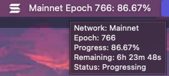

# Solana Epoch Tracker

A standalone macOS menu bar application that shows the current Solana epoch information. Track the current epoch, progress, and network status directly from your menu bar.

## Features

- Shows current epoch number and progress in the menu bar
- Displays remaining time until next epoch
- Supports Mainnet, Testnet, and Devnet networks
- Shows network status (Progressing/Halted)
- Updates automatically every minute
- Native macOS menu bar integration

> **Note:** This application queries the public Solana RPC endpoints once a minute to fetch epoch information. If you're already using these endpoints for other purposes, you might encounter rate limits. For more information about rate limits and available endpoints, please refer to the [Solana Clusters documentation](https://solana.com/docs/references/clusters).

## Installation

### Quick Install (macOS)
1. Download the latest `solana-epoch-tracker-1.0.0-arm64.dmg` from the [releases page](https://github.com/schmiatz/solana-epoch-tracker/releases)
2. Open the DMG file
3. Drag the Solana Epoch Tracker app to your Applications folder
4. Open the app from your Applications folder
5. (Optional) Enable "Open at Login" in System Preferences to have it start automatically

### From Source
1. Clone this repository:
   ```bash
   git clone https://github.com/schmiatz/solana-epoch-tracker.git
   cd solana-epoch-tracker
   ```

2. Install dependencies:
   ```bash
   npm install
   ```

3. Run in development mode:
   ```bash
   npm run dev
   ```

4. Build the application:
   ```bash
   npm run build
   ```
   The built application will be in the `dist` folder.

## Usage

1. Launch the application
2. The epoch information will appear in your menu bar
3. Click the menu bar icon to:
   - Switch between networks (Mainnet/Testnet/Devnet)
   - View detailed epoch information
   - Quit the application
4. Hover over the icon to see detailed information including:
   - Current network
   - Epoch number
   - Progress percentage
   - Remaining time
   - Network status

## Requirements

- macOS 10.13 or later
- Node.js 14 or later (only for building from source)

## Development

To run the app in development mode:
```bash
npm run dev
```

## Contributing

Contributions are welcome! Please feel free to submit a Pull Request.

## License

MIT License - see the [LICENSE](LICENSE) file for details

## Screenshots


